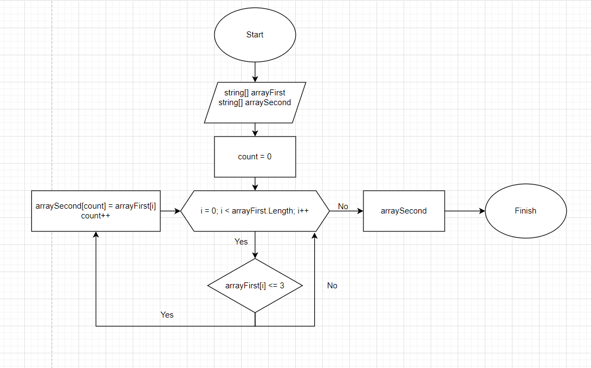

# **Контрольная работа**
## Задача:
>*Написать программу, которая из имеющегося массива строк формирует новый массив из строк, длина которых меньше, либо равна 3 символам. Первоначальный массив можно ввести с клавиатуры, либо задать на старте выполнения алгоритма. При решении не рекомендуется пользоваться коллекциями, лучше обойтись исключительно массивами.*

**Блок-схема алгоритма**

## Описание решения:

Объявляем первый массив строк. Далее объявляем второй массив строк (в нём мы будем сохранять нужный результат). Вводим переменную-счётчик count, которая будет индексом элементов второго массива, и присваиваем ей нулевое значение. Далее вводим переменную-счётчик i - индекс элементов первого массива, присваиваем переменной нулевое значение. Пока i меньше длинны первого массива делаем следующее: поочерёдно обращаемся к каждому элементу первого массива и проверяем: если количество символов в элементе равно трём, либо меньше трёх, тогда мы переносим элемент во второй массив и увеличиваем переменную count на единицу. Если количество символов в элементе больше трёх то мы продолжаем проверку увеличивая переменную i на единицу, обращаясь тем самым к следующему элементу. Когда проверка всех элементов первого массива окончена мы выводим получившийся второй массив.
